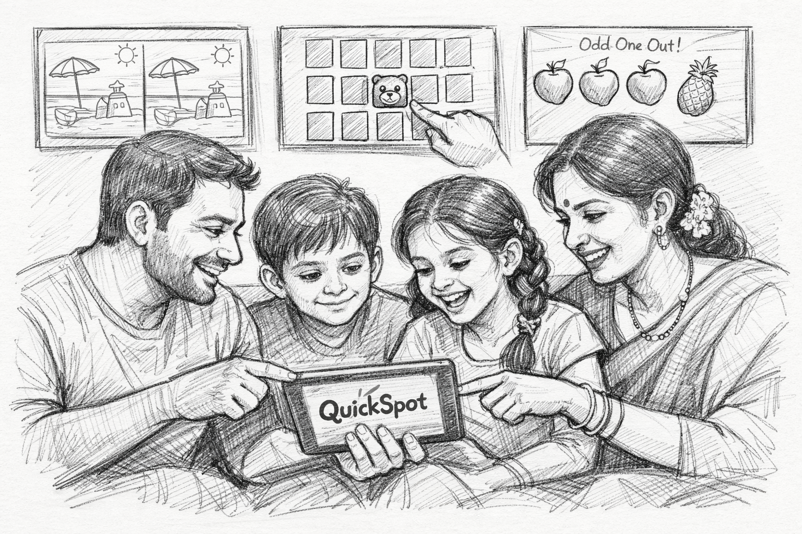

# 🎯 QuickSpot - AI-Powered Difference Detection Game

**Challenge your brain with AI-powered difference detection!**

QuickSpot is an innovative brain training platform that uses artificial intelligence to generate unlimited spot-the-difference puzzles. Sharpen your observation skills, improve your focus, and train your brain with engaging challenges.

## ✨ Features

- 🤖 **AI-Powered Puzzles**: Unlimited challenges generated by Google Gemini AI
- 🧠 **Brain Training**: Improve observation skills and attention to detail
- ⚡ **Real-time Detection**: Instant feedback on spotted differences
- 🎨 **Beautiful Interface**: Modern, gradient-rich design
- 🏆 **Progress Tracking**: Monitor your performance and improvement
- 📱 **Responsive Design**: Play seamlessly on any device

## 🛠️ Tech Stack

- **Framework**: [Next.js 15](https://nextjs.org/) with App Router
- **Language**: TypeScript
- **Styling**: Tailwind CSS
- **AI Integration**: Google Gemini API
- **Authentication**: Clerk
- **UI Components**: Radix UI, Lucide Icons
- **Deployment**: Vercel

## 🚀 Getting Started

### Prerequisites
- Node.js 18+ installed
- npm, yarn, pnpm, or bun package manager

### Installation

1. Clone the repository:
   ```bash
   git clone <repository-url>
   cd diffimages
   ```

2. Install dependencies:
   ```bash
   npm install
   # or
   yarn install
   # or
   pnpm install
   ```

3. Set up environment variables:
   Create a `.env.local` file with your API keys:
   ```env
   NEXT_PUBLIC_CLERK_PUBLISHABLE_KEY=your_clerk_key
   CLERK_SECRET_KEY=your_clerk_secret
   GEMINI_API_KEY=your_gemini_key
   ```

4. Run the development server:
   ```bash
   npm run dev
   # or
   yarn dev
   # or
   pnpm dev
   ```

5. Open [http://localhost:3000](http://localhost:3000) in your browser.

## 🎮 How It Works

1. **Sign In**: Create an account or sign in with Clerk authentication
2. **Start Playing**: Access the game dashboard
3. **Spot Differences**: Find all differences between two AI-generated images
4. **Track Progress**: View your performance and improvement over time
5. **Challenge Yourself**: Unlimited puzzles with varying difficulty levels

## 📁 Project Structure

```
diffimages/
├── src/
│   ├── app/              # Next.js app router pages
│   ├── components/       # React components
│   │   ├── ui/          # UI components (buttons, cards, etc.)
│   │   └── dashboard/   # Game-specific components
│   └── lib/             # Utility functions
├── public/
│   └── images/          # Static images and assets
└── ...
```

## 📸 Screenshots

[Add screenshots of your app here]

## 📧 Contact

**Developer**: NK Analytics

- **Email**: [narendra.insights@gmail.com](mailto:narendra.insights@gmail.com)
- **LinkedIn**: [linkedin.com/in/nk-analytics](https://www.linkedin.com/in/nk-analytics)

Feel free to reach out for questions, feedback, or collaboration opportunities!

## 📄 License

This project is created for educational and portfolio purposes.

## 🙏 Acknowledgments

- Powered by [Google Gemini AI](https://ai.google.dev/)
- Built with [Next.js](https://nextjs.org/)
- Styled with [Tailwind CSS](https://tailwindcss.com/)
- Icons from [Lucide](https://lucide.dev/)

---

Made with ❤️ by [NK Analytics](https://www.linkedin.com/in/nk-analytics)
